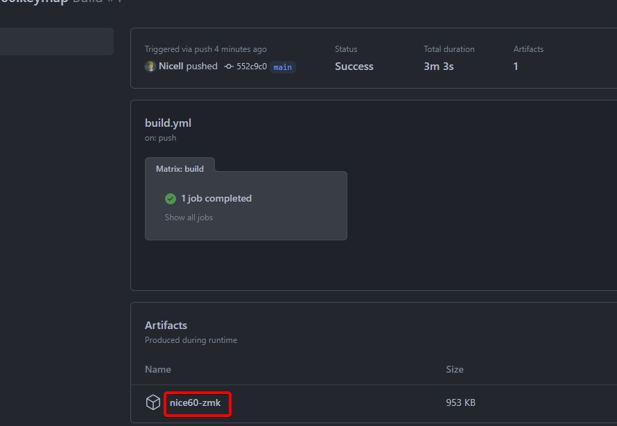

# Getting Started

This page will give a quick guide on what you'll need to build a keyboard with the nice!60, battery details, 
and how to customize your keymap.

## Required Parts

 - 61 Cherry MX Style Switches
 - Cherry MX Compatible Keycap Set with 60% ANSI Coverage
 - 4x2U, 1x6.25U Stabilizers
 - 3.7V Lithium Rechargeable Battery
   - At Least 500mAh
   - 2-Pin JST-PH (2.00mm) Connector
 - 60% Case (Standard GH60/DZ60 Style)
   - Keep in mind that a big metal cage is not necessarily cohesive with wireless connections. Metal cases have been tested and work generally the same, but they do impact the wireless performance
   - Make sure thickness of the of your battery and the depth of your case are compatible
 - (Optional) 60% ANSI Switch Plate
   - Recommended to keep the switches more solidly held into the keyboard

## Installing the Battery

When installing the battery on the nice!60, you'll notice it has a 3-pin JST-PH connector. 
This is done to accommodate batteries with the power or ground flipped either way. 
Make sure the red wire is being plugged into the PWR pin (in the middle) and the black wire is plugged into the GND pin (on the ends).

## Assembling the Keyboard

Here is a building stream of a nice!60 to guide you with your build.

 

<iframe width="100%" height="100%" style={{position: 'absolute', top: 0, left: 0}} src="https://www.youtube.com/embed/Ug-Xmkm0Qgs" title="YouTube video player" frameborder="0" allow="accelerometer; autoplay; clipboard-write; encrypted-media; gyroscope; picture-in-picture" allowfullscreen />

## Default Keymap

The nice!60 is preloaded with the ZMK firmware using the below keymap. Read more about [ZMK here](https://zmk.dev).

## Managing Wireless Profiles

Check out the [ZMK docs](https://zmk.dev/docs/behaviors/bluetooth) on how the wireless BLE works.

Generally to manage your profiles, you will use the first column of keys on the left side of the board on the function layer. 
Press the `Fn` key and the `Esc` key to erase the bond/device on the current active profile and go back into pairing mode. 
Press the `BT 1/2/3/4` keys on the left side on the `Fn` layer to switch between profiles. 

Extra notes:
 - You can't connect the same device to multiple profiles. If you're having troubles pairing, try clearing the rest of the profiles.
 - Don't disconnect the nice!60 from your computer or other device. This clears the bond information and means the nice!60 will refuse to reconnect until you press the `BT CLR` button.

## Creating a Custom Keymap and Firmware

Of course, the default keymap will not be perfect for everyone, so you can update your keymap and build new firmware without installing anything on your computer.

You will need a GitHub account to do this.

 1. Navigate to https://github.com/Nice-Keyboards/nice60-zmk-config
 2. Press the Fork button in the top right

 3. After forking is complete, click on the Actions tab

 4. Click on the "I understand" button to enable building your firmware using GitHub Actions

 5. Next click back to the Code tab to the left of the Actions tab

 6. Now we can edit the keymap. Click on the `config` folder

 7. Now click on the `nice60.keymap` file

 8. Click on the edit button 

 9. Edit the keymap as wanted. Use the [ZMK codes docs](https://zmk.dev/docs/codes/) to find standard HID input options you have for your keymap and check the [Behaviors category](https://zmk.dev/docs) on the left to find other ZMK specific behaviors.

 10. When done, scroll to the bottom and commit your changes. Feel free to add a commit title and description to track your changes

 11. Your new firmware should now be building. The first build will take a while. Click on the Actions tab to see the status. When it's complete it will have a green check instead of a yellow dot. If you have an error, you've probably missed a comma, semicolon, or typed in a non-existent key type. Check [this for more information](https://zmk.dev/docs/troubleshooting#dtlibdterror). Your `nice60.dts.pre.tmp` file is printed in the step after build.

 12. If your firmware builds properly, click on the build title

 13. Now click the `nice60-zmk` link to download your new firmware

 14. Unzip the files. You should have a `zmk.uf2` file, which you'll use

 15. Take your nice!60 and double-press the reset button on the back below the USB-C port and plug in the board to your computer

 16. You should get a new drive called `NICE60` if you properly double-pressed the reset button. Drag and drop or copy the `zmk.uf2` you have over to that drive

 17. After it's done your board should auto boot back into your new ZMK firmware. You're done!
