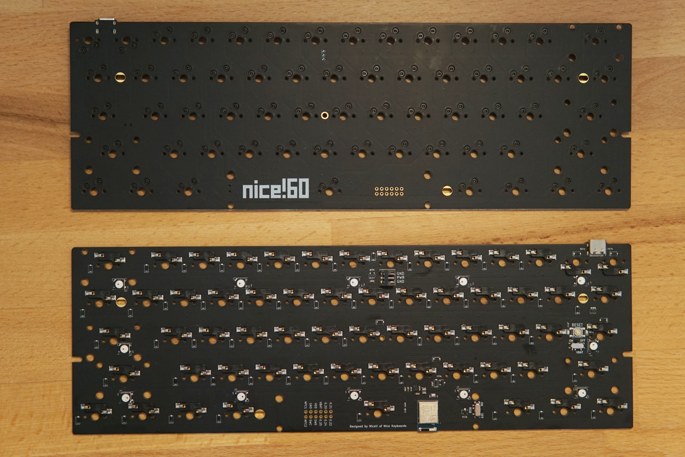

# nice!60

The nice!60 is a standard 60% ANSI hotswap PCB offering BLE using the nRF52840 chip. 
The nice!60 offers extremely long battery life as long as the underglow LEDs are kept off. 

To get your nice!60 up and running check out [**Getting Started**](/docs/nice-60/getting-started).

If you're a hardware designer interested to learn more about the schematic check out the [**Schematic**](/docs/nice-60/schematic).

## Recommended batteries

To run your nice!60 wirelessly, you need a battery. 
In specific, you need a 3.7v rechargeable lithium battery that is **at least 500mAh large**. 
Note when choosing a battery, the recharge rate is 500mA, so a 2,000mAh battery will take about 4 hours to charge. 
You'll want a battery that uses a 2-pin JST-PH (2.00mm) connector to properly attach the battery to the nice!60. 
While this is the most common connector type for hobbyist lithium batteries, double check that it's the right kind.

## Bootloader

The nice!60 uses the [Adafruit nRF52 Bootloader](https://github.com/Nice-Keyboards/Adafruit_nRF52_Bootloader). Check the releases of our fork for the most up to date `_nosd.hex` variant.
