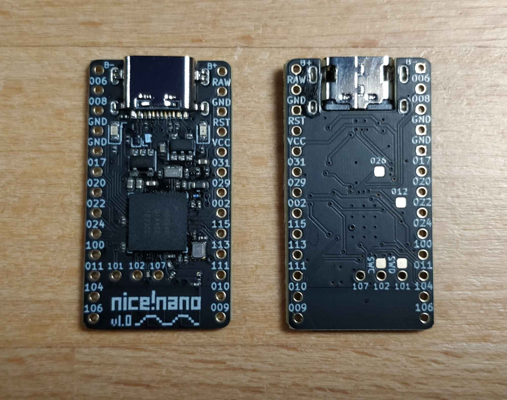

# nice!nano

The nice!nano is a Pro Micro replacement development board offering BLE using the nRF52840 chip. It has the same pinout as the Pro Micro meaning it will work with almost any Pro Micro keyboard. The nice!nano also has a 3.7V lithium battery charger on board as well as a software level switch to cut off power to LEDs, which can eat 1mA each even when off!

Want the backstory? Read the [nice!nano origin story](https://nick.winans.io/blog/nice-nano/).

Check out [**FAQs**](/docs/nice-nano/faq) if you have more questions. To get your nice!nano up and running check out [**Getting Started**](/docs/nice-nano/getting-started).

If you're a hardware designer interested to learn more about the pinout and schematic check out the [**Pinout and Schematic**](/docs/nice-nano/pinout-schematic).

## Mounting the controller

It's _highly_ recommended that you socket your nice!nano. It offers ease of access to the battery and makes debugging your keyboard so much easier. In short, it's a small investment to save you lots of time and possibly money in the future. **Standard female machine pin sockets are recommended to go along with the most commmon 100 mAh 301230 size battery**. In most cases the battery should fit underneath the socketed nice!nano. Be weary of flipped nice!nanos _with_ pins and other parts poking out underneath (you don't want to puncture your battery!). You can find these sockets on AliExpress all over the place.

## Connecting the battery

Depending on your project, your PCB shield may have a spot to connect the battery to the PCB and use a battery disconnect switch on the PCB. If this is present, this is the most recommended way, as you can then unplug the socketed controller from the shield and battery, and debug your build easily. This also adds the nice feature of having the keyboard stay off when jostled in a bag.

If no such accomodations exist on the shield, there are two intermidary options, that both offer the option to disconnect the battery. The first is to add a so called 'battery backpack' which is a small PCB that sits on the pins in-between the nice!nano and shield and adds a switch and a place to connect the battery. The next option is a simple pigtail, a JST plug for the battery on a small length of wire.

The simplest, and ultimately least preferred way, given that you cannot easily unplug or switch off the battery is to simply hardwire the battery to the two pad +/- on the top of the nice!nano. 

## Recommended batteries

To run your nice!nano wirelessly, you need a battery. In specific, you need a 3.7v rechargeable lithium battery (LiPO) that both physically fits your project, and also works with the nice!nano's charge parameters. **The overall recommended battery for most low power (no LEDs or extra power sinks) is the 301230 battery**. This battery is 3mm thick and fits underneath a socketed nice!nano very nicely. These can be found on some vendors' stores as well as on AliExpress.

If you want to use a different battery, it should be 'sized' electrically to fit the charger which has two settings, one with a charge rate of ~100 mAh which suits a battery from 100 mAh up to 500 mAh. Using a smaller battery than 100 mAh is not recommended as the battery's cycle life will be very short as it's essentially always overcharged. (In reality the actual charge rate is ~85 mAh, so you can get away with that size, but it will shorten the battery's lifespan.)

If using a battery above 500 mAh, you can enable the 'boost' solder jumper on the nice!nano and switch to a ~500 mAh charge rate. Again, note that using this setting with a smaller battery can cause it to be overcharged and damage the battery. the largest recommended size for the battery is 2000 mAh. Larger than that can cause issues and potentially damage your battery and/or nice!nano.

The reason for the upper limit is that ideally the battery should be charged at around a 0.25-0.5c charge rate, meaning at a quarter to half the input rate as the battery capacity. Above that (0.5-1c) is considered fast charging, and below that is considered trickle charging, which is outright bad for a lithium (LiPO) battery. Over time this builds upp resistance in the cell, making it harder for the charger to charge it, especially when fully depleted. This can be countered by occasionally fast charging the battery, but with the battery built into your keyboard, this is impractical to do. As a result, if an oversized battery is left to become fully depleted before being charged again, and with cell resistance built up, the battery will simply 'stall' and not take a charge if the charger cannot supply enough current to overcome the resistance. When that happens either the charger eventually will overheat and die, or the battery stops being charged and cannot be used in the keyboard (It is commonly assumed to be faulty).

## Bootloader

The nice!nano uses the [Adafruit nRF52 Bootloader](https://github.com/adafruit/Adafruit_nRF52_Bootloader). You can use the files from the release page of the repository, or you can use the v0.6.0 bootloader I have here. [Click here to download](/assets/nice_nano_bootloader-0.6.0_s140_6.1.1.hex).

## Specifications

- Mid mount USB-C port making the board a 3.2mm total thickness (thinner than a Pro Micro)
- nRF52840 chip on board with 1MB of Flash and 256KB of RAM
- Adafruit Bootloader loaded offering DFU flashing as well as flashing via UF2 storage (similar to dragging a file to a flash drive!)
- Programmable indicator (blue) LED as well as a charging indicator (orange) LED
- Battery voltage reader to report battery percentage to main device
- External power can be cut off using an on board MOSFET saving power from LEDs (each can draw 1mA when off!)
- 3 extra GPIO pins offering a total of 21 GPIO pins
- 3.3V out of the VCC pin to power external features
- 32.768 kHz oscillator on board for real-time clock capabilities
- Clean design with matte black solder mask, immersion gold plating, and Tg 170 FR4 for durability
