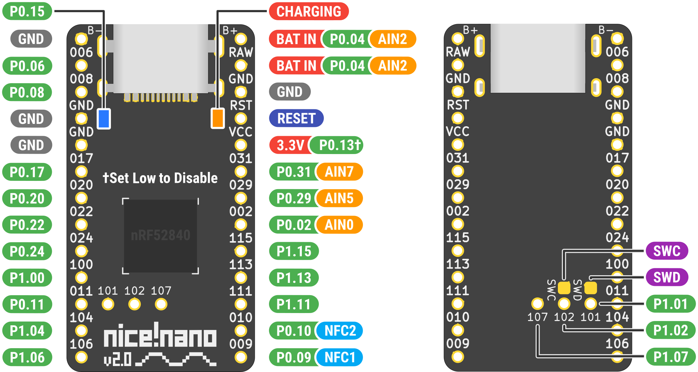
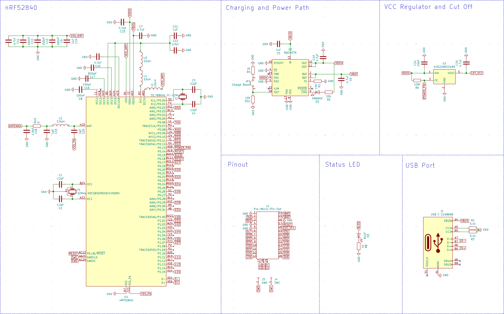
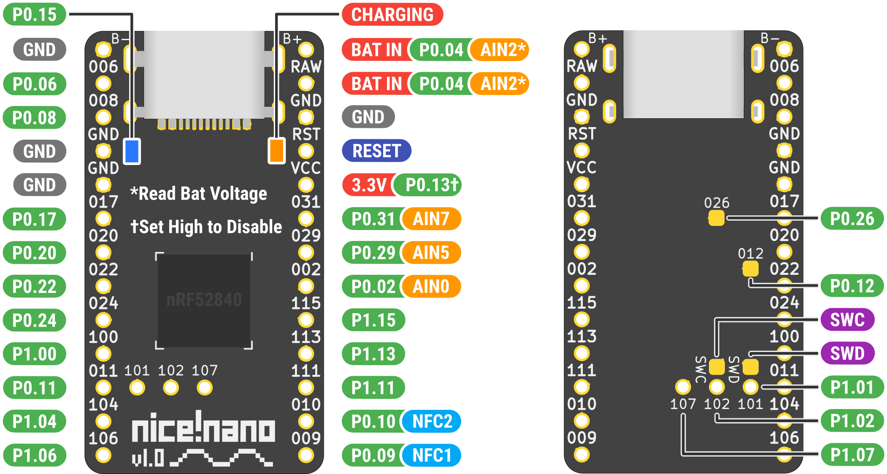
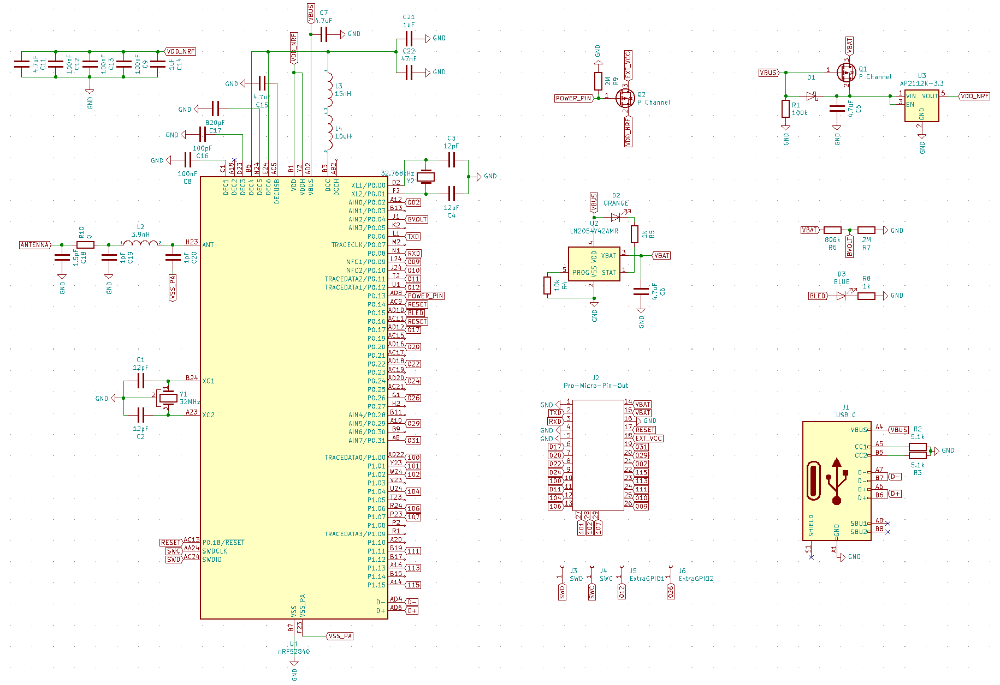

# nice!nano v2

## Pinout

### To further clarify:

- P0.04 (AIN2) is used to read the voltage of the battery via ADC. It can't be used for any other function.
- P0.13 on VCC shuts off the power to VCC when you set it to low
  - This saves on battery immensely for LEDs of all kinds that eat power even when off

## Schematic 

 
 

# nice!nano v1

## Pinout

### To further clarify:

- P0.04 (AIN2) is used to read the voltage of the battery via ADC. It can't be used for any other function.
- P0.13 on VCC shuts off the power to VCC when you set it to high
  - This saves on battery immensely for LEDs of all kinds that eat power even when off

## Schematic

