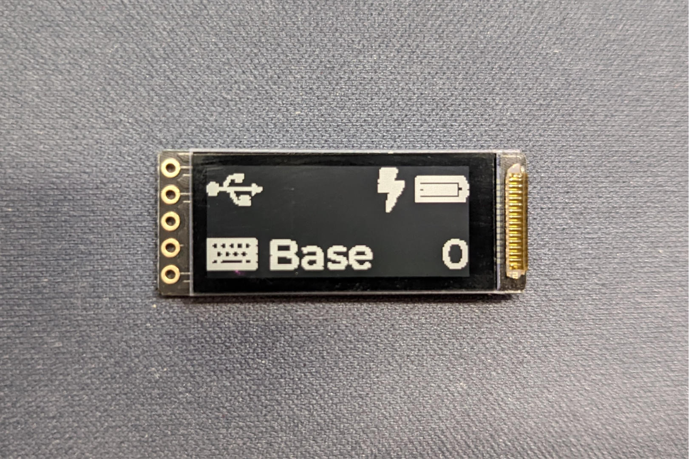

# nice!view

The nice!view is a SSD1306 OLED replacement boasting >1,000x power savings while keeping a 30Hz refresh rate. It has a similar pinout to SSD1306 OLEDs with one extra pin making it easy to add on to existing boards. 

To get your nice!view up and running check out [**Getting Started**](/docs/nice-view/getting-started).

If you're a hardware designer interested to learn more about the pinout and schematic check out the [**Pinout and Schematic**](/docs/nice-view/pinout-schematic).

## Specifications

- 160x68 pixel resolution with a diagonal size of 1.08"
- 36x14x2.9mm dimensions
- 30Hz refresh rate
- <10uA typical power draw
- Conformal coat to reduce the possibility of shorts
- Socket and pins included
- 3-wire SPI protocol
- 3.3V voltage
- Sharp LS011B7DH03 display
