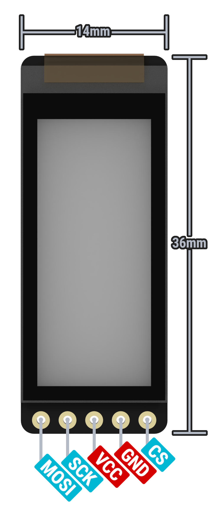
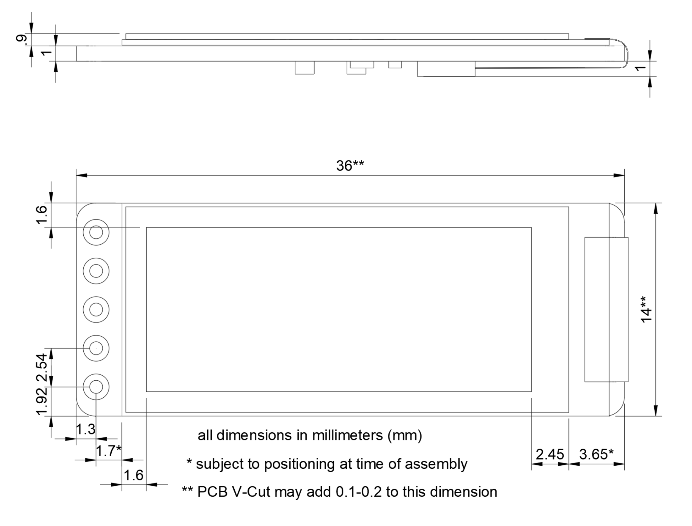
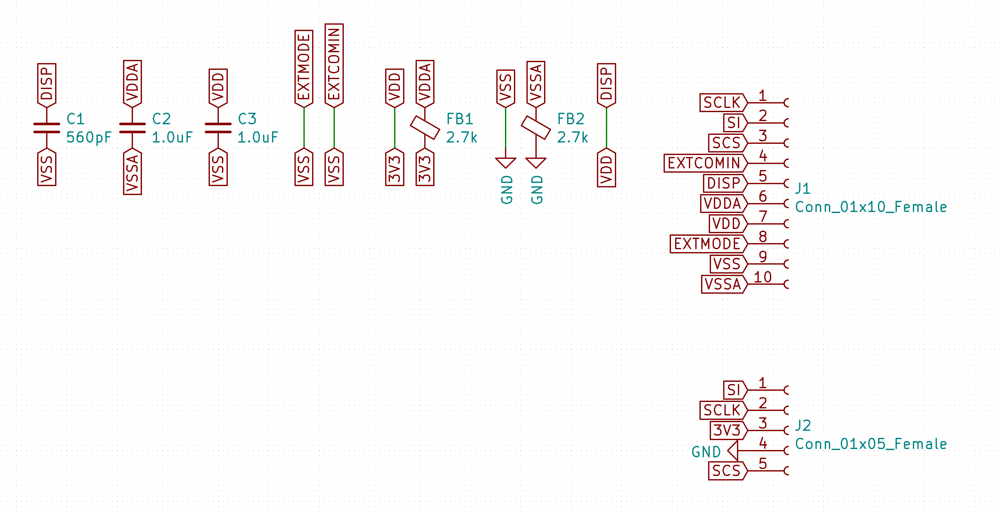

## Pinout

## Dimensions

## Schematic 

## Default pins

The nice!nano can be configured to use almost any pins for the nice!view display, and you would then need to configure these in the firmware of your choice. To design a shield that uses the default pins and the easy to use nice!view adapter in ZMK, please use these pins:

- CS = D1 / P0.06
- MOSI = D2 / P0.17
- SCK = D3 / P0.20
